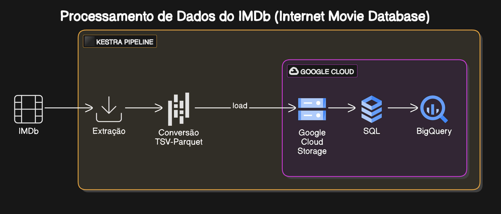
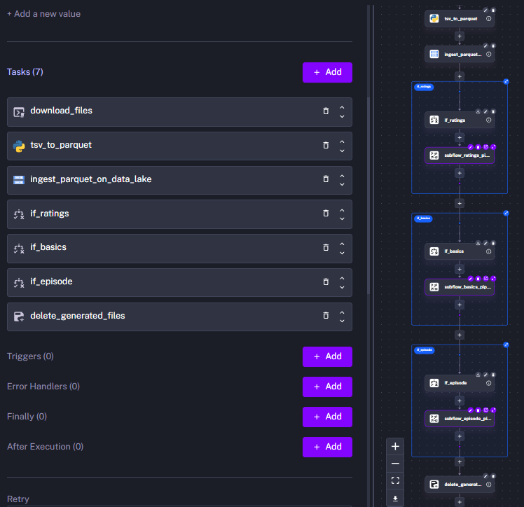

# Pipeline de Extração e Carga de dados do IMDb (Internet Movie Database)

### Arquitetura

### Descrição

Este projeto teve como intuito a **implementação de uma pipeline de dados** que **extrai arquivos TSV** (Tab-Separated Values) do [IMDb Non-Commercial Datasets](https://developer.imdb.com/non-commercial-datasets/), que contém tanto informações gerais sobre filmes e séries, entre outros, como informações sobre as avaliações dos usuários, **processa os dados** e faz a **ingestão dos mesmos no BigQuery** (Google Cloud).  

Tarefas da pipeline:

**1.** Download dos arquivos em TSV

**2.** Conversão dos arquivos TSV para o formato Apache Parquet

**3.** Carga dos arquivos em .parquet para o Data Lake (Bucket do Google Cloud Storage)

**4.** Tratamento dos dados via SQL (Bigquery)

**5.** Carga dos dados em tabelas do BigQuery 

### Ferramentas Utilizadas

**1. Docker** - Deploy do Orquestrador de Fluxos de Trabalho (ferramenta de pipeline)

**2. Terraform** - Provisionamento dos recursos na nuvem Google Cloud Storage (Dataset do Bigquery e Bucket do Google Cloud Storage)

**3. Kestra** - Implementação da pipeline de dados

**4. Pandas** - Transformação dos arquivos .tsv para .parquet

**5. Google Cloud Storage** - Para servir como Data Lake (Bucket)

**6. BigQuery** - Para servir como um Data Warehouse

Importante salientar que as tabelas finais importadas no BigQuery não estão modeladas para servir de data warehouse/data mart, estas tabelas podem ser consideradas como uma "camada raw" para a criação de fatos e dimensões. Também seria possível utilizar uma abordagem de "schema on read" (ELT) para fazer análises sobre os dados.

### Sobre o Projeto

No Kestra é possível criar pipelines tanto através de código-fonte em YAML como a através de No-Code / Low-Code. Para esta pipeline foram definidos 4 arquivos .yml, que estão na pasta 'flows'.

**1. Arquivo kv.yml**

Este arquivo contém pares chave-valor com informações sobre a autenticação do acesso ao GCP. Quando o mesmo é executado no Kestra, os valores passam a fazer parte do storage interno do kestra (em PostgreSQL) e passam a estar disponíveis para todas as pipelines do namespace. Namespace é uma organização lógica para cada projeto. 

**2. Arquivo pipeline.yml**

Este arquivo contém o fluxo principal da pipeline. Através da execução dele é possível fornecer os parâmetros da execução, fazer o download dos arquivos para o storage do Kestra, converter para Parquet, ingerir os arquivos convertidos no Data Lake (GCS) e decidir qual dos 3 subfluxos serão utilizados.

Visão No-Code e Topológica da pipeline:

**3. Arquivo subflow_basics.yml**

**4. Arquivo subflow_ratings.yml**

**5. Arquivo subflow_episode.yml**