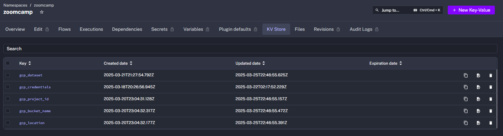
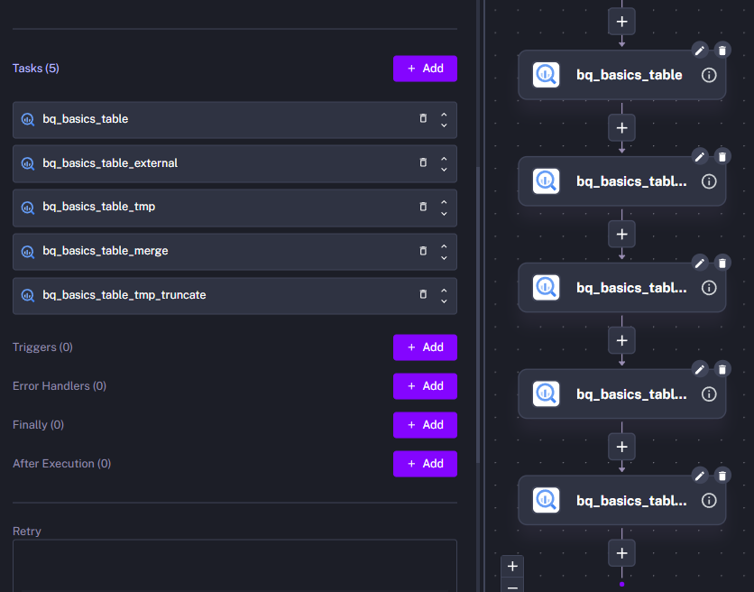
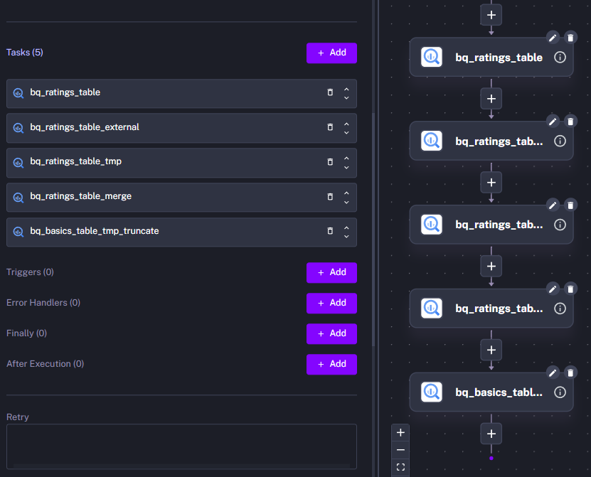
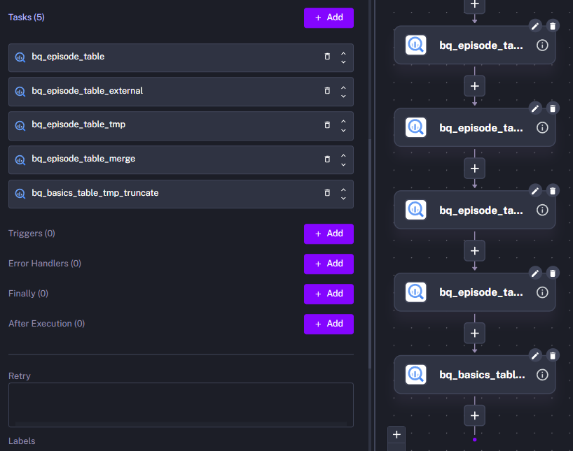

# Pipeline de Extração, Transformação e Carga de dados do IMDb (Internet Movie Database)

## 📚 Índice

- [Arquitetura](#arquitetura)
- [Descrição](#descrição)
- [Ferramentas Utilizadas](#ferramentas-utilizadas)
- [Sobre o Projeto](#sobre-o-projeto)
  - [1. Arquivo kv.yml](#1-arquivo-kvyml)
  - [2. Arquivo pipeline.yml](#2-arquivo-pipelineyml)
    - [Tasks](#tasks)
  - [3. Arquivo subflow_basics.yml](#3-arquivo-subflow_basicsyml)
    - [Tasks](#tasks-1)
  - [4. Arquivo subflow_ratings.yml](#4-arquivo-subflow_ratingsyml)
  - [5. Arquivo subflow_episode.yml](#5-arquivo-subflow_episodeyml)
- [Alguns pontos de melhoria](#alguns-pontos-de-melhoria)

## Arquitetura


## Descrição

Este projeto implementa uma **pipeline de dados orquestrada no Kestra**, com o objetivo de **extrair**, **transformar** e **carregar** dados do [IMDb Non-Commercial Datasets](https://developer.imdb.com/non-commercial-datasets/) no **BigQuery**, utilizando o **Google Cloud como infraestrutura**. Os dados são inicialmente **baixados em formato TSV**, **convertidos para Parquet**, **armazenados em um Data Lake (GCS)**, **transformados via SQL** e **carregados em tabelas gerenciadas do BigQuery**.

**Tarefas da pipeline**:

**1.** Download dos arquivos em TSV

**2.** Conversão dos arquivos TSV para o formato Apache Parquet

**3.** Carga dos arquivos em .parquet para o Data Lake (Bucket do Google Cloud Storage)

**4.** Tratamento dos dados via SQL (Bigquery)

**5.** Carga dos dados em tabelas do BigQuery 

## Ferramentas Utilizadas

**1. Docker** - Deploy do Orquestrador de Fluxos de Trabalho (ferramenta de pipeline)

**2. Terraform** - Provisionamento dos recursos na nuvem Google Cloud Storage (Dataset do Bigquery e Bucket do Google Cloud Storage)

**3. Kestra** - Implementação da pipeline de dados

**4. Pandas** - Transformação dos arquivos .tsv para .parquet

**5. Google Cloud Storage** - Para servir como Data Lake (Bucket)

**6. BigQuery** - Para servir como um Data Warehouse

## Sobre o Projeto

No Kestra é possível criar pipelines tanto através de código-fonte em YAML como através de No-Code / Low-Code. Para esta pipeline **foram definidos 5 arquivos .yml, que estão na pasta 'flows'**.

### **1. Arquivo kv.yml**

Este arquivo contém **pares chave-valor com informações sobre a autenticação do acesso ao GCP**. Quando o mesmo é executado, os valores passam a fazer parte do storage interno do Kestra (em PostgreSQL) e passam a estar disponíveis para todas as pipelines do namespace. **Namespace** é uma organização lógica para cada projeto e pode conter várias pipelines. 



### **2. Arquivo pipeline.yml**

Este arquivo contém o fluxo principal da pipeline. Através da execução dele é possível **fornecer os parâmetros da execução**, **fazer o download dos arquivos** para o storage do Kestra, **converter para Parquet**, **ingerir os arquivos convertidos no Data Lake** (GCS) e **decidir qual dos 3 subfluxos serão executados**.

Visão No-Code e Topológica do Fluxo Principal:


#### **Tasks**:

**download_files**

**'tsv_file'** é uma variável que foi definida tendo como base o valor de input fornecido ao executar a pipeline. A função 'render' é necessária para que o valor seja corretamente construído com base nos inputs.

```yaml
- id: download_files
    type: io.kestra.plugin.scripts.shell.Commands
    description: Baixa e salva o arquivo .tsv já descompactado, através de comando de CLI.
    outputFiles:
      - "*.tsv"
    taskRunner:
      type: io.kestra.plugin.core.runner.Process
    commands:
      - wget -qO- https://datasets.imdbws.com/{{render(vars.tsv_file)}}.gz | gunzip > {{render(vars.tsv_file)}}
```

**tsv_to_parquet**

CSV's, e por consequência TSV's, não possuem metadados inerentes, portanto trata-se apenas de arquivos de texto. Ler com o pandas antes e depois converter para o parquet garante que a inferência de tipos do pandas seja utilizada e que os tipos de dados façam parte dos metadados do parquet.  

```yaml
- id: tsv_to_parquet
    type: io.kestra.plugin.scripts.python.Script
    description: Converte os arquivos .tsv em parquet para economizar espaço no data lake.
    beforeCommands:
      - pip install pandas fastparquet
    outputFiles:
      - "*.parquet"
    script: |
      import pandas as pd

      # Obtendo o caminho do arquivo baixado
      tsv_data = "{{render(vars.tsv_data)}}"

      # Carregando o arquivo TSV
      df = pd.read_csv(tsv_data, sep="\t", low_memory=False)

      # Salvando como Parquet
      df.to_parquet('{{render(vars.parquet_file)}}', index = False, engine = "fastparquet")
```

**ingest_parquet_on_data_lake**

Com as credenciais configuradas, basta apontar para o endereço do bucket.

```yaml
- id: ingest_parquet_on_data_lake
    type: io.kestra.plugin.gcp.gcs.Upload
    description: Carrega os arquivos parquet no data lake (bucket do GCS).
    from: "{{render(vars.parquet_data)}}"
    to: "{{render(vars.gcs_file_parquet)}}"
```

**if_ratings**

Condição para caso o input seja 'ratings', que é o nome de um arquivo baixado. Um subflow é executado juntamente com os parâmetros necessários.

```yaml
- id: if_ratings
    type: io.kestra.plugin.core.flow.If
    condition: "{{inputs.file_name == 'ratings'}}"
    description: |
        Executa um subflow dedicado ao arquivo 'ratings', que contém as notas dadas pelos usuários aos filmes/séries.
        Essa tabela não precisa ser particionada / clusterizada, pois seu tamanho é pouco mais de 30 MB.
    then:
      - id: subflow_ratings_pipeline
        type: io.kestra.plugin.core.flow.Subflow
        flowId: ratings_pipeline
        namespace: zoomcamp
        inputs:
          table: "{{render(vars.table)}}"
          gcs_file_parquet: "{{render(vars.gcs_file_parquet)}}"
          parquet_file: "{{render(vars.parquet_file)}}"
        wait: true # a pipeline principal irá esperar a execução do subflow finalizar para prosseguir
        transmitFailed: true # o pipeline principal irá falhar caso a execução do subflow falhe
```

**if_basics**

Idêntico à task if_ratings, com algumas adaptações.

**if_episode**

Idêntico à task if_ratings, com algumas adaptações.

**delete_generated_files**

Depois que os dados são carregados no data lake, não se faz necessário mantê-los localmente.

```yaml
  - id: delete_generated_files
    type: io.kestra.plugin.core.storage.PurgeCurrentExecutionFiles
    description: Exclui os arquivos produzidos pela pipeline.
    disabled: false
```

### **3. Arquivo subflow_basics.yml**

**Os 3 subflows seguem praticamente a mesma estrutura**, portanto o aprofundamento será feito apenas neste.

Visão no e low code da pipeline.


#### **Tasks**:

**bq_basics_table**

Criação da tabela definitiva. **A clusterização foi feita para otimizar consultas que façam agrupamentos utilizando a coluna titleType**.

As colunas **filename** e **unique_row_id** não são originais do dataset, a primeira foi criada apenas para guardar o nome do arquivo de origem, a segunda foi para servir de identificador único de um registro.

```yaml
    - id: bq_basics_table
        type: io.kestra.plugin.gcp.bigquery.Query
        description: Cria a tabela principal no BigQuery.
        sql: |
          CREATE TABLE IF NOT EXISTS `{{kv('gcp_project_id')}}.{{inputs.table}}`
          (
              unique_row_id BYTES,
              filename STRING,
              tconst STRING,
              titleType STRING,
              primaryTitle STRING,
              originalTitle STRING,
              isAdult BYTES,      
              startYear BYTES,
              endYear BYTES,
              runtimeMinutes BYTES,
              genres STRING
          )
          CLUSTER BY 
             titleType;
```

**bq_basics_table_external**

Criando uma tabela com base no arquivo parquet presente no data lake.

```yaml
    - id: bq_basics_table_external
        type: io.kestra.plugin.gcp.bigquery.Query
        description: Cria a tabela externa com os dados do parquet do data lake.
        sql: |
          CREATE OR REPLACE EXTERNAL TABLE `{{kv('gcp_project_id')}}.{{inputs.table}}_external`
          (
              unique_row_id BYTES,
              filename STRING,
              tconst STRING,
              titleType STRING,
              primaryTitle STRING,
              originalTitle STRING,
              isAdult BYTES,      
              startYear BYTES,
              endYear BYTES,
              runtimeMinutes BYTES,
              genres STRING
          )
          OPTIONS (
              format = 'PARQUET',
              uris = ['{{inputs.gcs_file_parquet}}']
          );
```

**bq_basics_tmp**

Essa **tabela temporária funciona como uma tabela de staging**. **Aqui é calculado o identificador único do registro com base em várias colunas**. O valor do **hash** é conseguido com a função MD5.

```yaml
- id: bq_basics_table_tmp
        type: io.kestra.plugin.gcp.bigquery.Query
        description: Cria uma tabela temporária para ser mergeada com a tabela principal. Aqui eu crio um hash para identificar um registro de forma única.
        sql: |
          CREATE OR REPLACE TABLE `{{kv('gcp_project_id')}}.{{inputs.table}}_tmp`
          AS
          SELECT
            MD5(CONCAT(
              COALESCE(CAST(tconst AS STRING), ""),
              COALESCE(CAST(primaryTitle AS STRING), ""),
              COALESCE(CAST(originalTitle AS STRING), ""),
              COALESCE(CAST(startYear AS STRING), "")
            )) AS unique_row_id,
            "{{inputs.parquet_file}}" AS filename,
              tconst,
              titleType,
              primaryTitle,
              originalTitle,
              isAdult,      
              startYear,
              endYear,
              runtimeMinutes,
              genres
          FROM `{{kv('gcp_project_id')}}.{{inputs.table}}_external`;
```

**bq_basics_merge**

Aqui é feito um **merge entre a tabela definitiva e a tabela temporária utilizando o hash de ambas como chave**. Funções hash sempre devolvem a mesma chave se os mesmos inputs forem fornecidos, portanto se um registro da tabela temporária já estiver na tabela final, ele será desconsiderado.

```yaml
      - id: bq_basics_table_merge
        type: io.kestra.plugin.gcp.bigquery.Query
        description: Merge entre a tabela principal e a tabela temporária.
        sql: |
          MERGE INTO 
            `{{kv('gcp_project_id')}}.{{inputs.table}}` T
          USING 
            `{{kv('gcp_project_id')}}.{{inputs.table}}_tmp` S
          ON 
            T.unique_row_id = S.unique_row_id
          WHEN NOT MATCHED THEN
          INSERT 
            ( unique_row_id, 
              filename, 
              tconst,
              titleType,
              primaryTitle,
              originalTitle,
              isAdult,      
              startYear,
              endYear,
              runtimeMinutes,
              genres )
          VALUES 
            ( S.unique_row_id, 
              S.filename, 
              S.tconst,
              S.titleType,
              S.primaryTitle,
              S.originalTitle,
              S.isAdult,      
              S.startYear,
              S.endYear,
              S.runtimeMinutes,
              S.genres );
```

**bq_basics_table_tmp_truncate**

Por fim, a tabela temporária e a tabela externa são excluídas.

```yaml
      - id: bq_basics_table_tmp_truncate
        type: io.kestra.plugin.gcp.bigquery.Query
        description: Excluindo a tabela temporária e a tabela externa.
        sql: |
          DROP TABLE `{{kv('gcp_project_id')}}.{{inputs.table}}_tmp`;
          DROP TABLE `{{kv('gcp_project_id')}}.{{inputs.table}}_external`;
```

### **4. Arquivo subflow_ratings.yml**

Idêntico ao arquivo subflow_basics, com algumas adaptações.

Visão no e low code da pipeline.


### **5. Arquivo subflow_episode.yml**

Idêntico ao arquivo subflow_basics, com algumas adaptações.

Visão no e low code da pipeline.


## Alguns pontos de melhoria:

**1. Modelagem Dimensional** 

Organizar as tabelas finais no formato estrela ou snowflake, facilitando análises OLAP.

**2. Tratamento de Dados** 

Implementar regras para lidar com campos nulos ou valores ausentes, melhorando a qualidade dos dados.

**3. Redução de redundância** 

Modularizar trechos repetidos entre os subflows para facilitar manutenção e reutilização de código.

**4. Visualização de Dados** 

Desenvolver dashboard para acompanhar métricas como número de filmes por ano, gêneros mais comuns, notas médias etc.